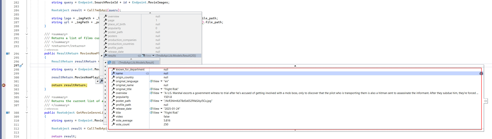
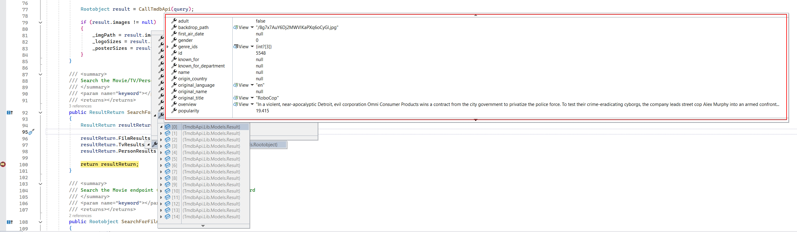

-----------------------------------------------------------------------------
TmdbApi.Lib - TMDB (The Movie Database) RESTful API C# Wrapper - About:
-----------------------------------------------------------------------------

First created on: 09/09/2024

I am a avid film fan so when my nephew introduced me to the TMDB (The Movie Database) RESTful API on one of his demo projects i was keen to give it a go myself and try it out.

In order to utilise the TMDB API effectively across multiple project types i decided to make a C# wrapper (Class library project) for it.  This project includes some basic unit tests for the API as well as a console based test harness for testing out commands.  This project can perform the following TMDB API commands:

- Return configuration data.
- Return movie/TV/person data.
- Search for a movie.
- Search for a TV show.
- Search for a person (Actor for eg)
- Search for credits associated with a movie/TV show.
- Search for credits associated with a person.
- Return movie/TV show/person artwork/posters.
- Return movies now playing in cinemas.
- Get genres associated with a movie/TV show.

Technologies / Principles Used:

- C#
- .NET 8.0
- .NET Core
- RESTful API
- TMDB API (The Movie Database)
- Console
- Class Library
- RestSharp
- Newtonsoft.Json
- TDD (Microsoft Test Framework, Fluent Assertions, Fluent Validation)

Requirements:

- Developer license key for TMDB API (The Movie Database) - Available for free

Resources / Credits:

- https://www.themoviedb.org/?language=en-GB
- https://developer.themoviedb.org/reference/intro/getting-started

Images:

