-----------------------------------------------------------------------------
Movie/TV Tracker & TMDB (The Movie Database) Rest API C# Wrapper
-----------------------------------------------------------------------------

First created on: 09/09/2024

I am a avid film fan so when my nephew introduced me to the TMDB Rest API on one of his demo projects i was keen to give it a go myself and try it out.

1.

The first part of this project is a C# wrapper (Class library project) i have created for the TMDB Rest API with a console test harness.  This class library makes integration of the TMDB Rest API into other applications simple.

2.

The second part of this project is a full-stack application consisting of a ASP.NET MVC Core website frontend with a SQL Server database backend.  The application utilises the C# wrapped version of the TMDB Rest API to perform the below capabilities:

- Movie, tv show, actor/actress search.
- Display of movies currently showing in the cinema in the UK.
- Display of movie information.
- Display of tv show information.
- Display of actor/actress information.
- Ability to mark films/tv shows the user has watched and have them displayed under a dedicated section for reference.
- Ability to mark favorite actors and have them displayed under a dedicated section for reference.

NOTE!:

This project is still in active development and will have further optimizations made as time goes on. My main focus is to implement the main core functions of the API and then as it progresses add in quality of life and efficiency improvements.

Technologies / Principles Used:

- C#
- ASP.NET MVC Core
- Console
- Class Library
- REST API
- TMDB API
- NET Core (Console & Class Library)
- CSS / Bootstrap Themes & Icons
- RestSharp
- Newtonsoft.Json
- Entity Framework - Code first approach
- SQL Server Express backend database

Requirements:

- SQL backend database to be installed.

Resources / Credits:

- https://www.themoviedb.org/?language=en-GB
- https://developer.themoviedb.org/reference/intro/getting-started
- https://getbootstrap.com/docs/5.3/getting-started/introduction/
- https://icons.getbootstrap.com/
- https://bootswatch.com/sandstone/

Images:

Visual examples of some of the returned data from the rest based TMDB Api.

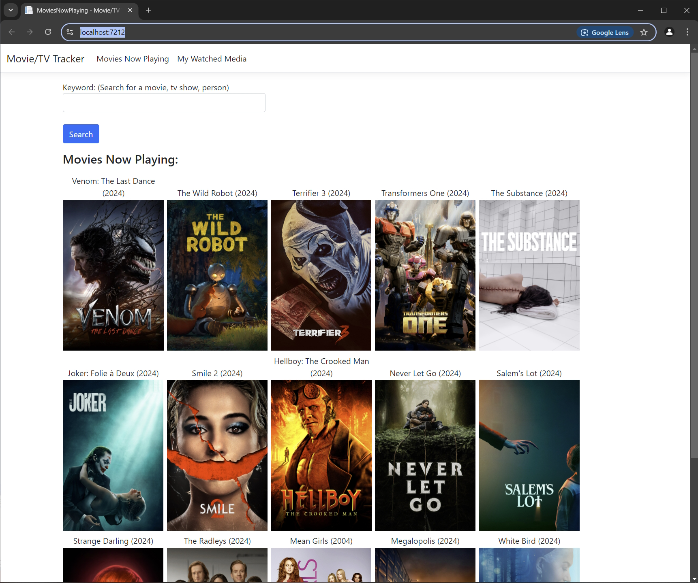
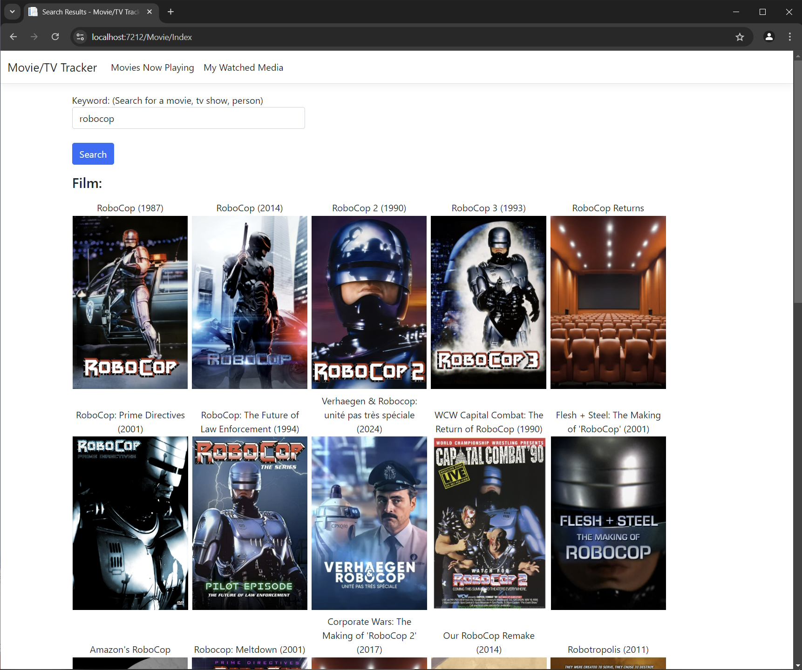
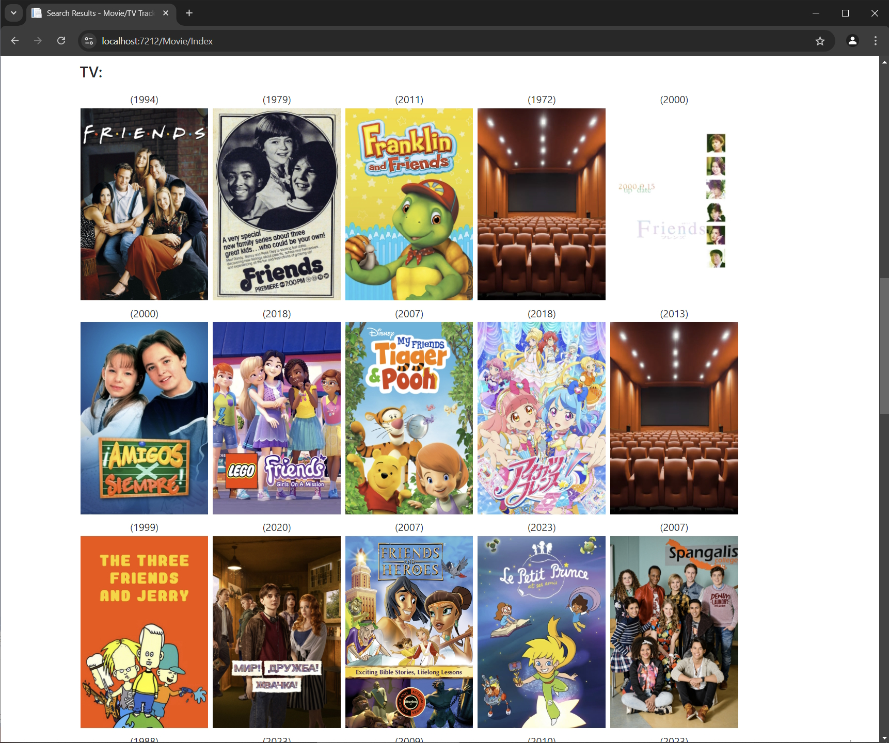
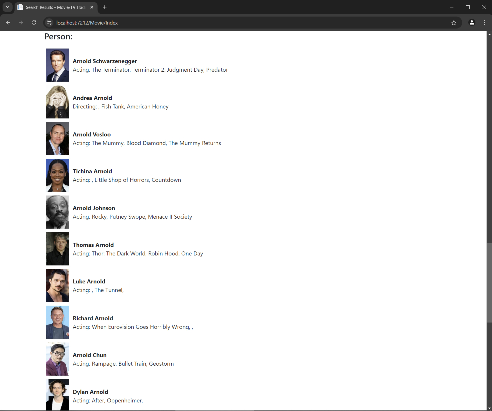
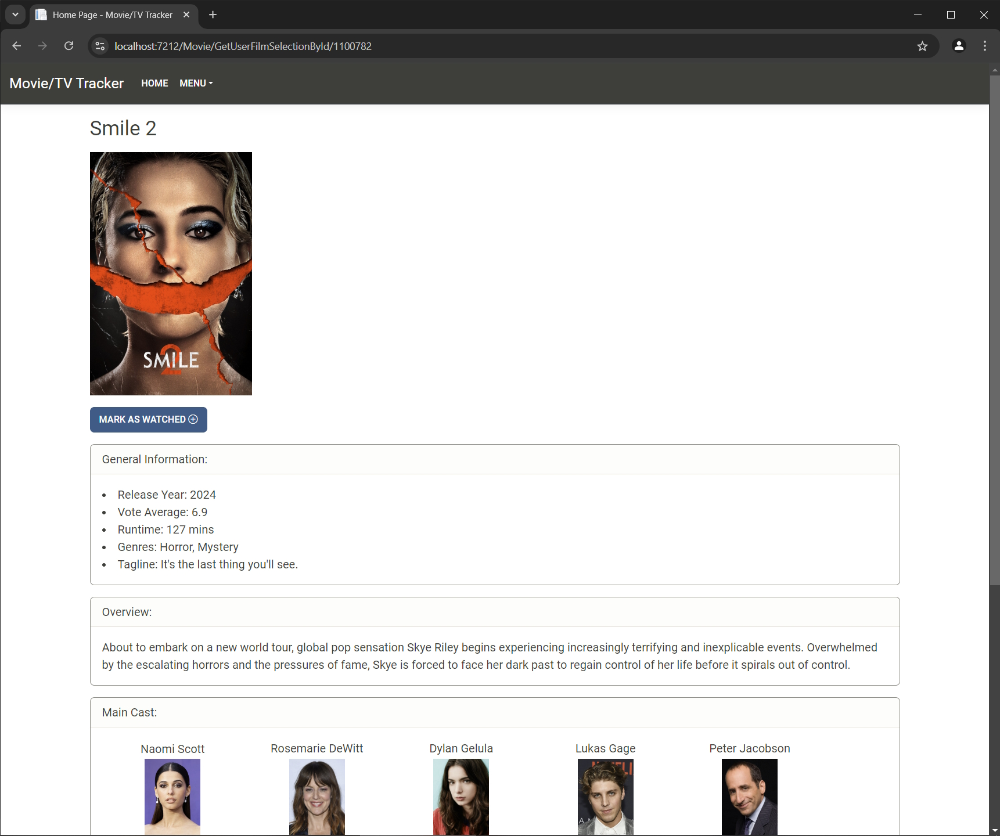
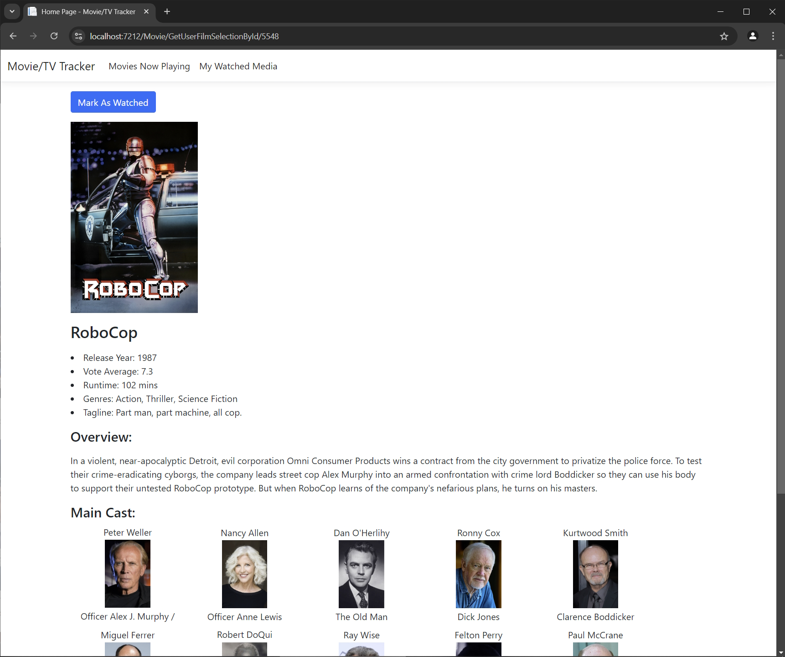
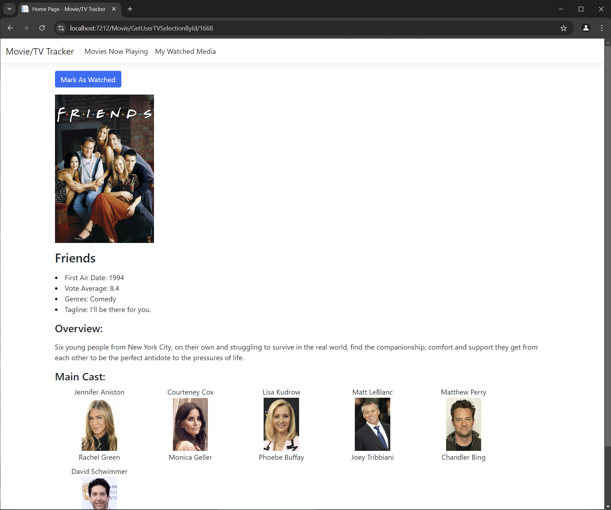
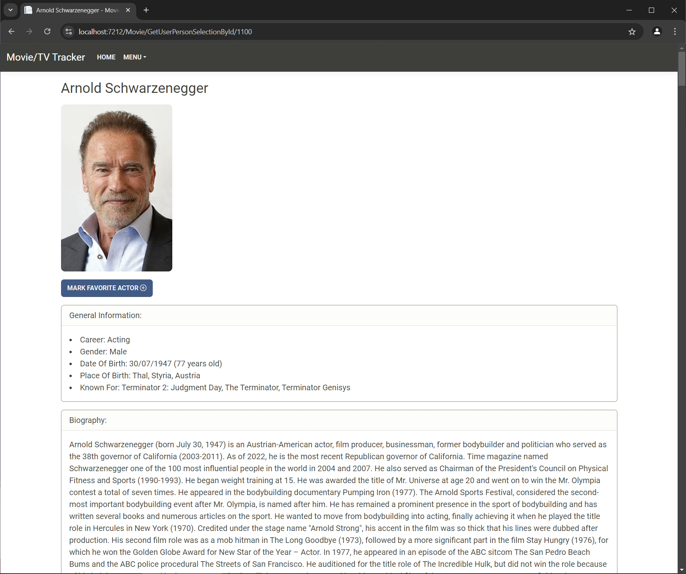
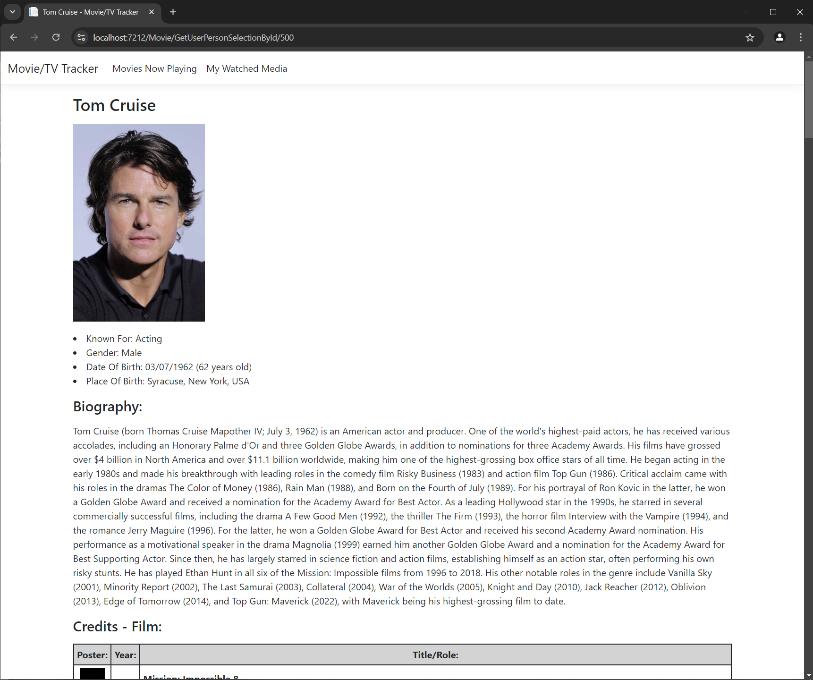
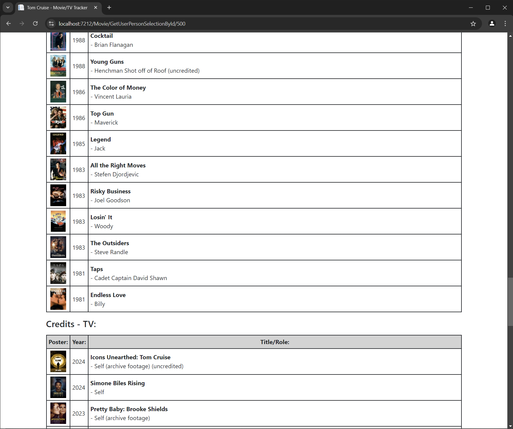
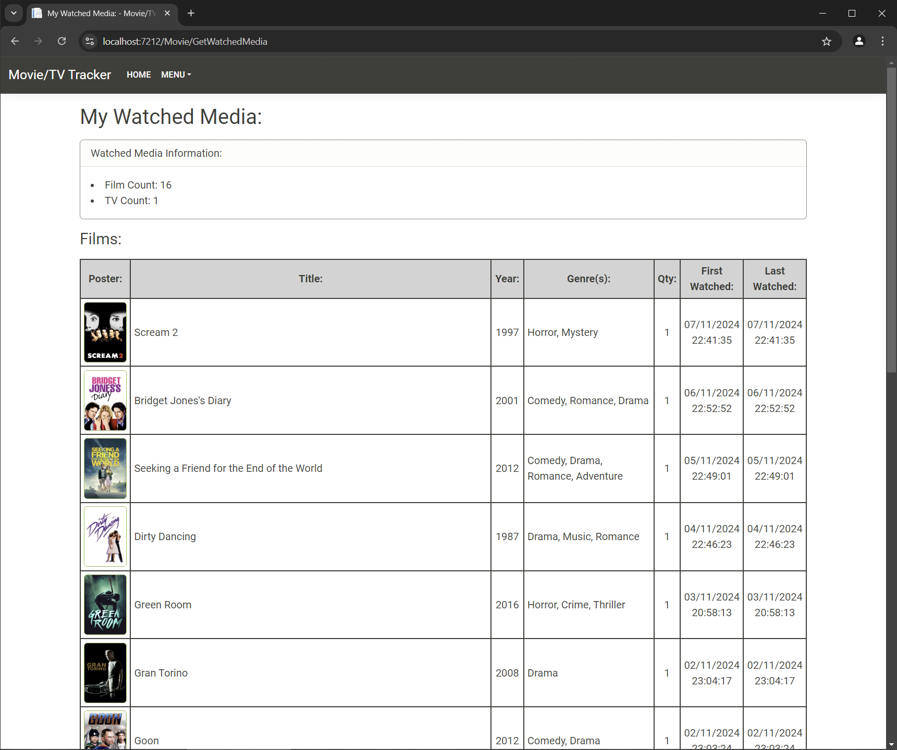
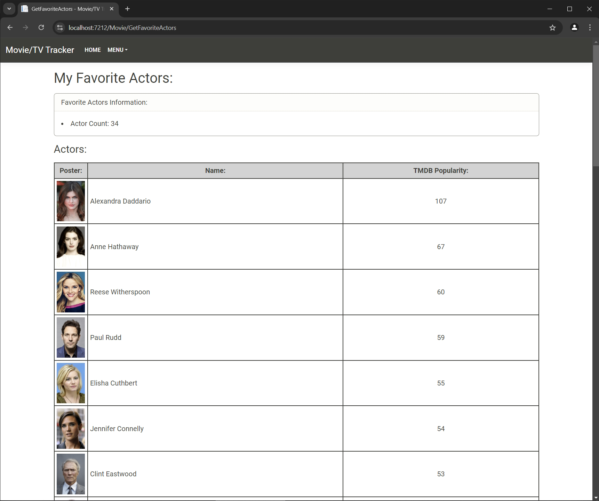

