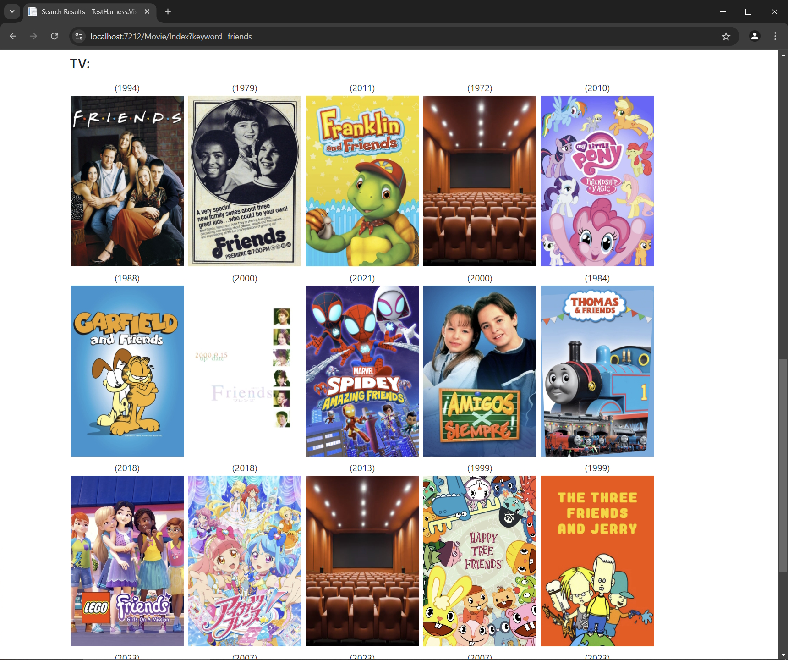
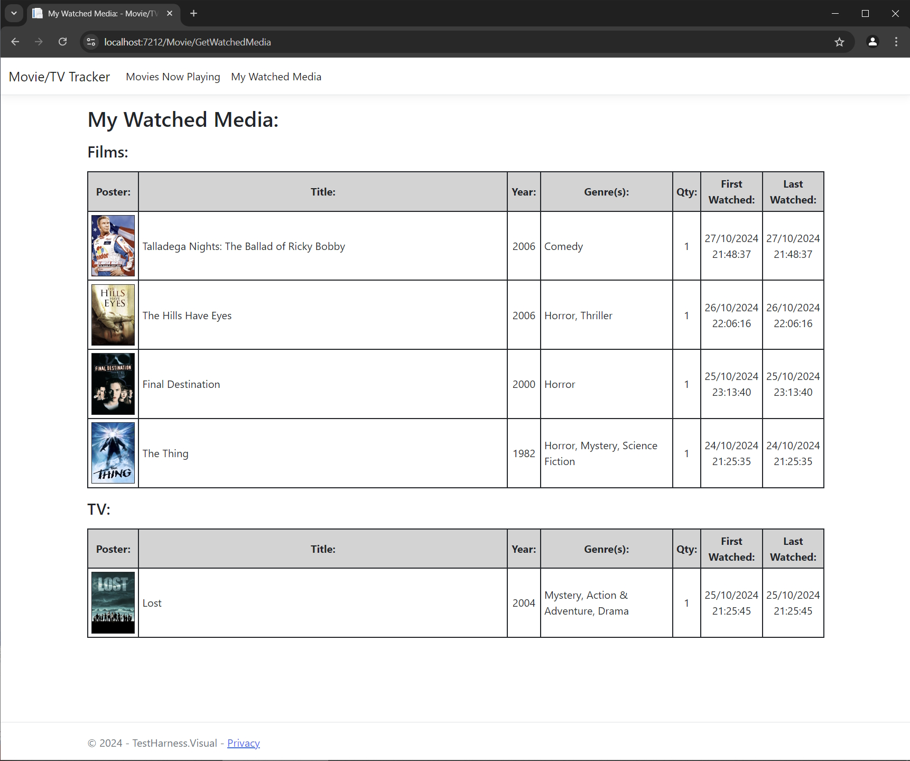

------------------------------------------------------
TMDB (The Movie Database) Rest API & Movie/TV Tracker
------------------------------------------------------

First created on: 09/09/2024

I am a avid film fan in my personal life so when i discovered the TMDB API (The Movie Database - www.themoviedb.org) from my nephew that had used it on one of his personal projects i was keen to give it a try.  I have begun creating a C# wrapper (Class library project) for this with both a console and a ASP.NET MVC Core website test harness to allow me to call and test the API easily.  As my capabilities and confidence with this API increase my plan is to slowly replace the visual test harness side with a movie/TV tracking application.

NOTE!:

This project is still in active development and will have further optimizations made as time goes on. My main focus is to implement the main core functions of the API and then as it progresses add in quality of life and efficiency improvements.

Technologies / Principles Used:

- C#
- ASP.NET MVC Core
- Console
- Class Library
- REST API
- TMDB API
- NET Core (Console & Class Library)
- RestSharp
- Newtonsoft.Json
- Entity Framework - Code first approach
- SQL Server Express backend database

Requirements:

SQL backend database to be installed.

Resources / Credits:

- https://www.themoviedb.org/?language=en-GB
- https://developer.themoviedb.org/reference/intro/getting-started

Images:

Visual examples of some of the returned data from the rest based TMDB Api.

